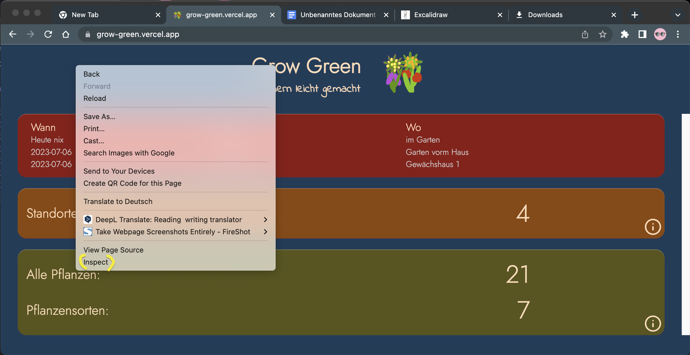
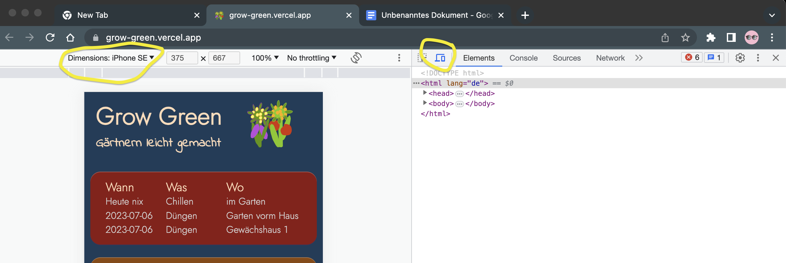
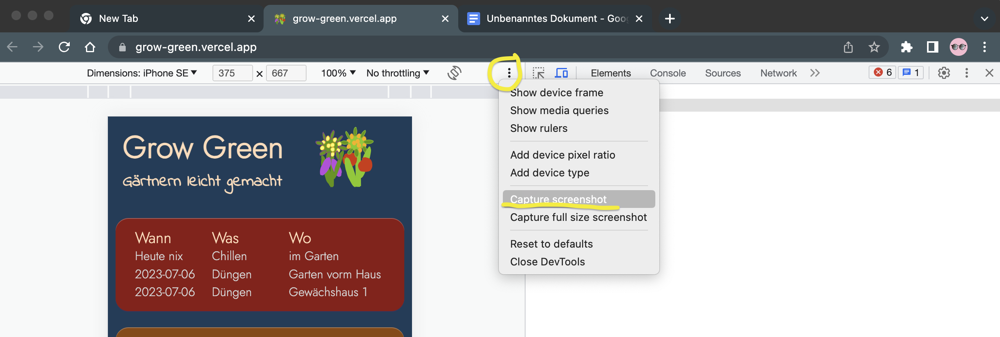
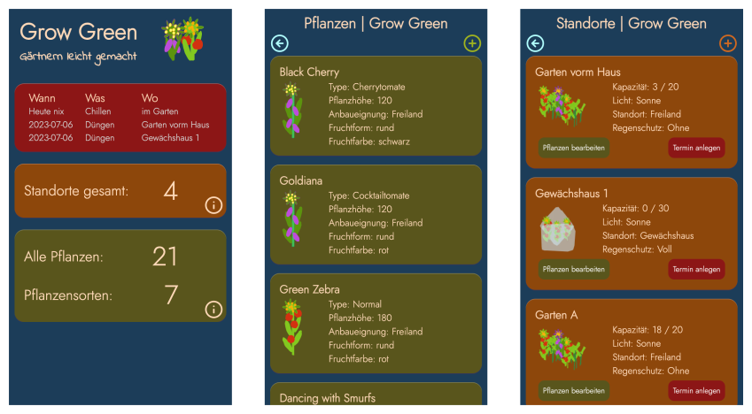

# Screenshot for REDAME.md

Inserting screenshots into the REDME is easy.  
You will need:

- Googel Chrome
- excalidraw.com
- vs code

---

Here I describe how to take screenshots of your web development (app) easily and for free and then include them in a README.md. Feel free to have a look at the source code here.

## 1. open page

Open your website/app in Googel Chrome.

## 2. set display size

Set the desired display size. Press F12 or right mouse button on the page and select **_Inspect_**.  
 

## 3. set view

Set the desired size of the view by pressing **_cmd-shift-m_** or clicking the second icon to the right of the center.

## 4. create screenshot

You create the screenshot via the 3 points (kebab menu) and the menu item Capture screenshot. Chrome stores the images - if not set differently - in the folder Download. Alternatively, you can use the shortcut cmd-shift-p and then type "screenshot".

## 5. open excalidraw.com

[https://excalidraw.com/](https://excalidraw.com/)

## 6. insert screenshots

You can simply drag and drop the saved screenshots into Excalidraw and align them there.

## 7. export SVG

With CMD-Shift-E you call the export. Alternatively with a click in the burger menu. If you save a SVG without background, you get a file that can be placed optimally in a readme. The simple (1x) size is perfectly sufficient.

## 8. save the file

## 9. insert file in VS Code

In VS Code you can now simply drag and drop the file into the readme. Hold down the Shift key before releasing the mouse button.

## 10. That's it. Good luck.

Feel free to send me a comment if something doesn't (or no longer) work.
