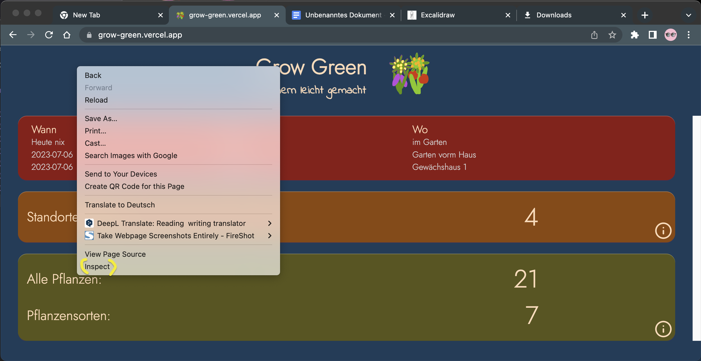
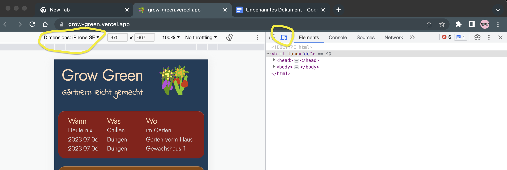
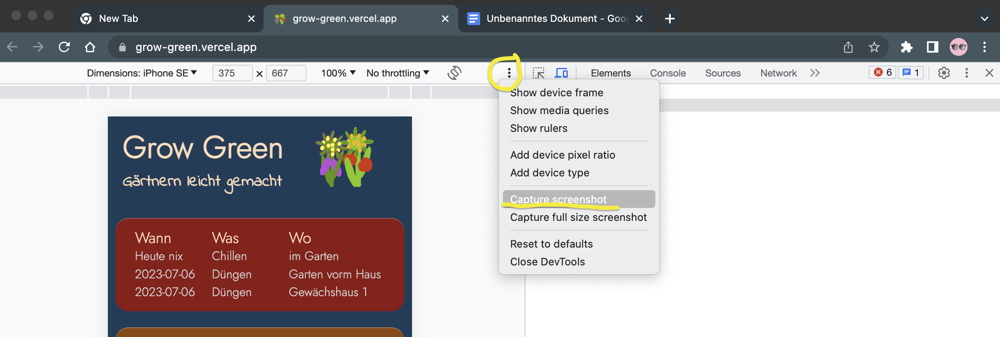
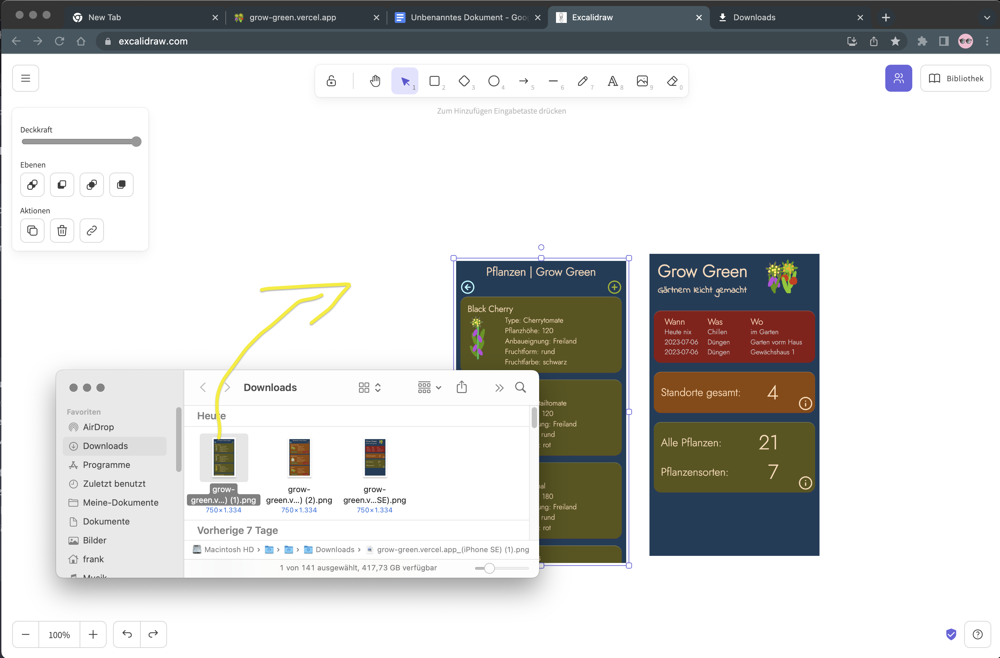
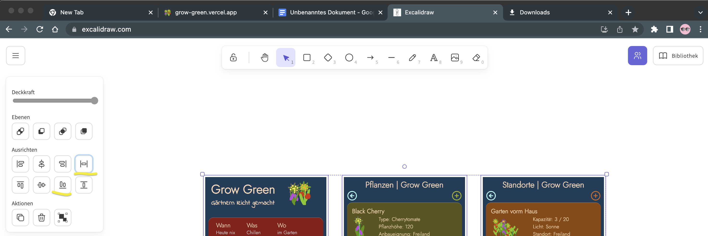
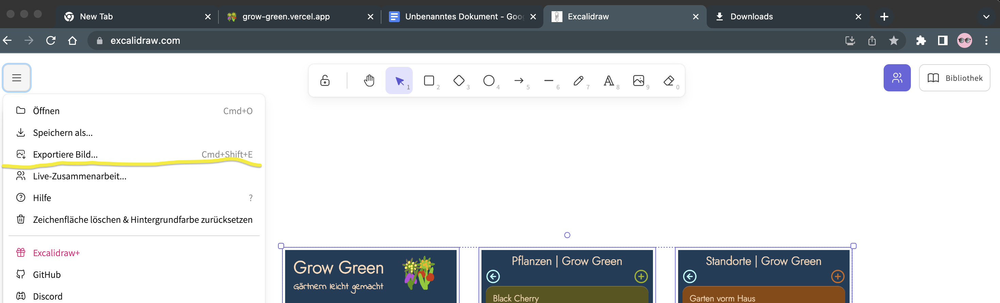
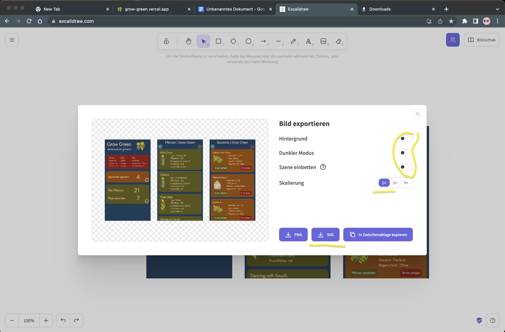
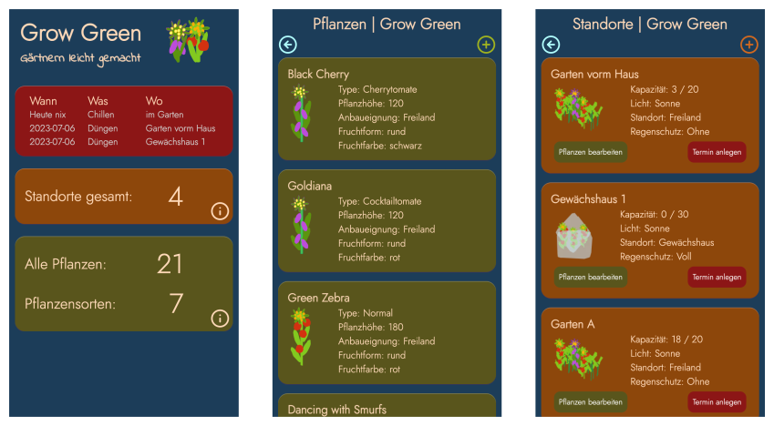

# Screenshot for README.md

Incorporating screenshots into the README is simple.  
You will need:

- Google Chrome
- excalidraw.com
- VS Code

---

In this guide, I'll show you how to easily take screenshots of your web development project (or app) for free and then include them in a README.md. Feel free to check out the source code here.

## 1. Open page

Launch your website/app in Google Chrome.

## 2. Set display size

Adjust the desired display size. Press F12 or right-click on the page and select **_Inspect_**.  
 

## 3. Set view

Define the size of the view by pressing **_cmd-shift-m_** or clicking the second icon to the right of the center.

## 4. Create screenshot

Generate the screenshot via the three dots (kebab menu) and select the "Capture screenshot" menu item. Chrome saves the images - unless set differently - in the "Downloads" folder. Alternatively, you can use the shortcut cmd-shift-p and then type "screenshot".

## 5. Open excalidraw.com

[https://excalidraw.com/](https://excalidraw.com/)

## 6. Insert screenshots

You can simply drag and drop the saved screenshots into Excalidraw and arrange them as needed.

## 7. Export SVG

Use CMD-Shift-E to trigger the export. Alternatively, click in the hamburger menu. If you save an SVG without a background, you'll get a file that fits perfectly in a readme. The simple (1x) size is entirely adequate.

## 8. Save the file

## 9. Insert file in VS Code

In VS Code, you can now simply drag and drop the file into the readme. Press and hold the Shift key before releasing the mouse button.

## 10. That's it. Good luck.

If you come across any issues, or something doesn't work anymore, please feel free to leave a comment.
